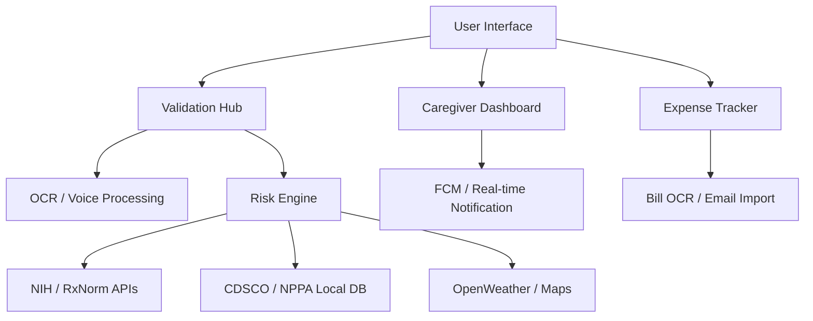

  

<h1 align="center">💊 Medaurin: The Proactive Medicine Guardian</h1>

  <strong>Beyond Simple Tracking — A Premium, AI-Powered Healthcare Security Ecosystem</strong>

  
  
  
  

  
  
  

---

## 🚀 Vision
Medaurin is not just another medicine tracker; it's a **proactive health shield**. In a world where drug-drug interactions and misinformation cause thousands of fatalities yearly, Medaurin provides an intelligent, clinical-grade validation engine directly in the pocket of every user. Built with a focus on **healthcare transparency** and **elderly accessibility**.

---

## 🎨 Immersive User Experience

### 💎 Comprehensive Health Suite
Medaurin provides a 360-degree approach to wellness:
- **Interactive Symptom Checker**: AI-driven analysis to understand early warning signs.
- **Precision Doctor Finder**: Locate specialists based on detected conditions.
- **Dynamic 3D Visualization**: A Real-time Three.js/React-Three-Fiber hero scene visualizing the medicine validation process.
- **Adaptive Aesthetics**: Seamless Dark/Light mode integration with vibrant gradients and backdrop blurs.
- **Micro-interactions**: High-fidelity animations across all user actions for a premium SaaS feel.

### 🎤 Inclusive Design
- **Offline Voice Input**: Powered by Whisper AI for hands-free entry (ideal for the elderly).
- **Photo OCR**: Instant medicine recognition using Tesseract.js directly in the browser.
- **Text-to-Speech**: AI-generated audio results for better accessibility.

---

## 🔬 Core Engineering Challenges Solved

### 1. Robust Medicine Validation Pipeline
Implemented a complex normalization engine that merges data from 4+ global clinical authorities:
- **RxNorm**: Standardized naming for clinical drugs.
- **FDA**: Real-time label data, side effects, and warnings.
- **NIH Interaction API**: Detecting potential drug-drug conflicts.
- **MEDRT (RxClass)**: Contraindication detection (Diseases vs. Drugs).
- **Fuzzy Matching Strategy**: 90%+ similarity thresholding to prevent false identification of non-medicinal products.

### 2. The "6-Factor" Risk Engine
A proprietary scoring algorithm that assesses safety across six critical vectors:
- **Drug-Drug Interactivity**: Immediate alerts on clinical conflicts.
- **Polypharmacy Multiplier**: Increased risk scoring for multiple concurrent prescriptions.
- **Environmental Sensitivities**: Real-time alerts based on **OpenWeatherMap** (e.g., UV sensitivity for Doxycycline).
- **Disease Contraindications**: Cross-referencing user health profile with clinical contraindicated lists.
- **Double Dosing Shield**: Real-time tracking of medication logs to prevent accidental overdose.
- **Regional Compliance Verification**: Real-time matching against **CDSCO** (Banned lists) and **NPPA** (Price caps) for enhanced safety and financial protection.

### 3. Offline-First Architecture
Medaurin is resilient. Many of its core safety features work even without a stable internet connection:
- **Local Datasets**: Pre-built JSON databases for Indian brand mapping and government validation.
- **In-Browser Processing**: OCR and Voice processing happen locally, ensuring 100% privacy.
- **Service Worker Caching**: Full PWA support for critical data persistence.

### ⚡ Technical Excellence
- **Type-Safe Engineering**: Comprehensive use of **TypeScript** and **Zod** for schema validation across the stack.
- **Performance Optimization**: Implemented custom **concurrency limiting** for batch API requests to maintain high throughput without hitting rate limits.
- **Intelligent Caching**: Multilayered caching strategy (Memory + Persistent) to minimize API latency and operational costs.
- **Relational Integrity**: Optimized PostgreSQL schema with Prisma, featuring deep indexes and cascaded relationships for complex caregiver mappings.

---

## 👨‍⚕️ Caregiver Guardian Mode
A real-time monitoring suite designed for family members and healthcare workers.
- **Live Dashboard**: Patient adherence tracking with real-time status updates.
- **Predictive Score Tracking**: Dynamic mastery percentages based on dosage logs.
- **Remote Alerts**: Caregivers receive push notifications (FCM) when a patient skips a dose or encounters a high-risk interaction.

---

## 🏗️ System Architecture

---

## �️ Technical Stack & Tools

| Category | Technology |
|---|---|
| **Frontend** | Next.js 15 (App Router), React 19, TypeScript, Tailwind CSS 4, Three.js |
| **Backend** | Next.js API Routes, PostgreSQL (Neon), Prisma ORM |
| **AI / OCR** | Tesseract.js, Whisper AI (offline), Text-to-Speech |
| **Data & APIs** | FDA openFDA, NIH RxNorm/RxClass, OpenStreetMap, OpenWeatherMap |
| **Mobile** | Capacitor 8 (Android SDK 24+), Native Plugins, PWA |
| **Security** | AES-256 Encryption, Session-based Auth, User Data Isolation |
| **DevOps** | Vercel, Railway, GitHub Actions |

---

## � Smart Financial Management

Medaurin tackles the "hidden costs" of healthcare:
- **Price Transparency**: Auto-detects if a pharmacy is overcharging above the government ceiling price.
- **Pharmacy Finder**: Locates nearby pharmacies using **OpenStreetMap** with integrated navigation.
- **Email Invoice Import**: Seamlessly syncs pharmacy bills from Gmail/Outlook using secure IMAP integration.
- **Budget Intelligence**: Analytics dashboard with categorical spending insights and forecast alerts.

---

## � Security & Privacy First
- **Zero Data Leakage**: Sensitive medical data is processed locally. 
- **End-to-End Encryption**: User credentials and email passwords are encrypted using **AES-256-CBC**.
- **GDPR Compliant**: Built with privacy-by-design principles from the ground up.

---

  <strong>Built with ❤️ for a safer tomorrow.</strong>

  

